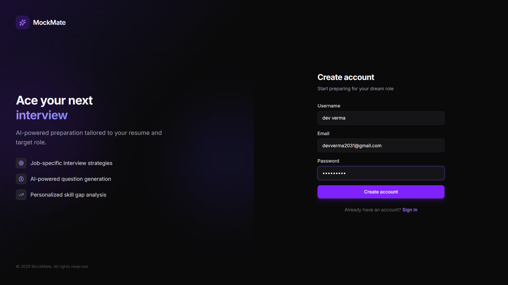
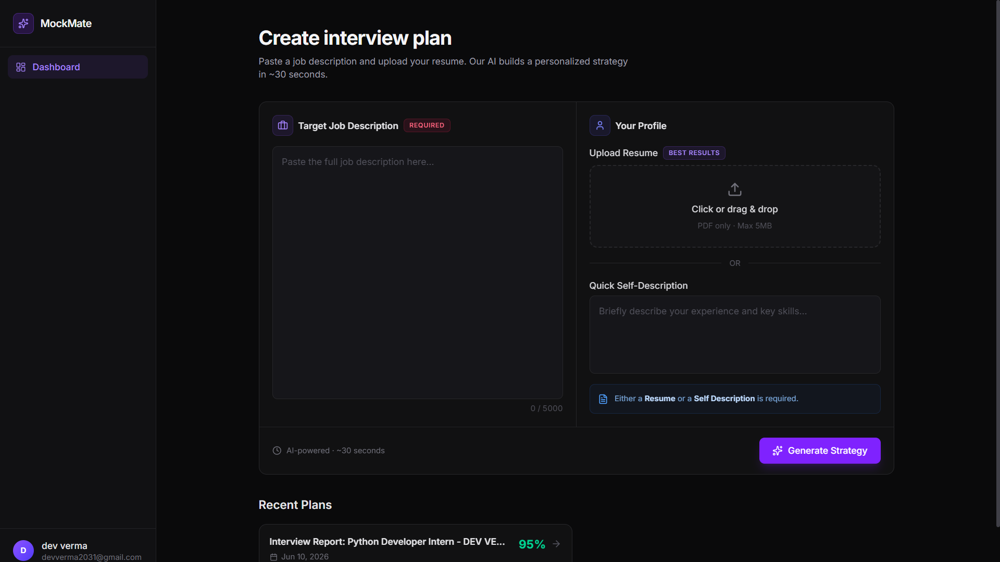
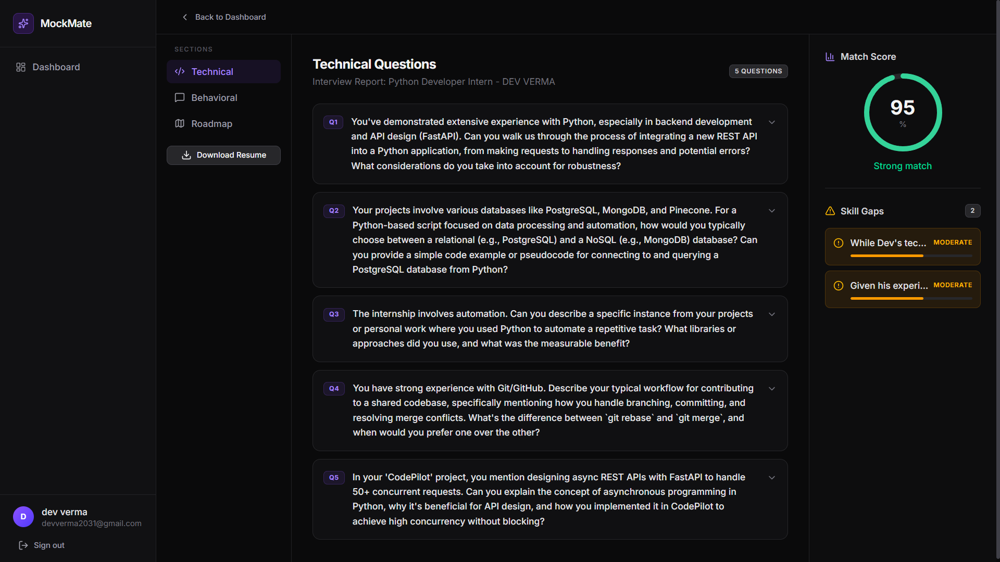
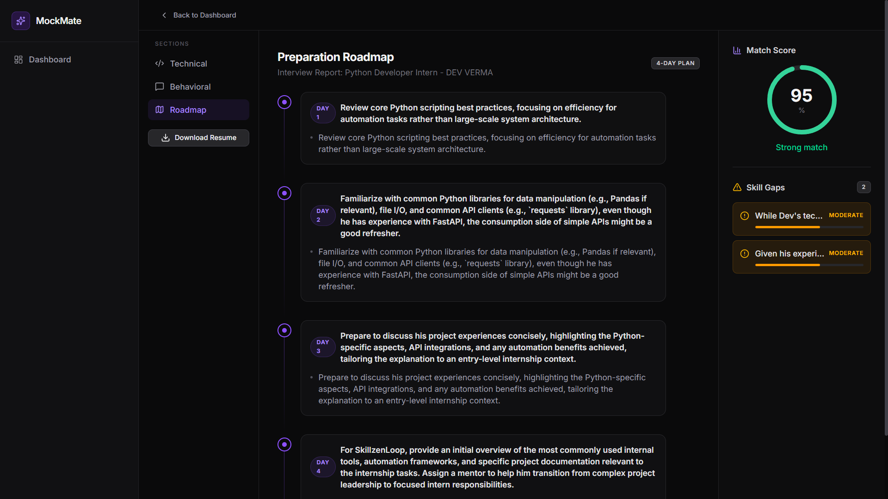

# MockMate

**AI-powered interview preparation platform** — upload your resume, paste a job description, and get a personalized interview strategy with match scoring, skill gap analysis, practice questions, and a learning roadmap.

---

## Features

- **Authentication** — Secure sign up and login with JWT cookies
- **Resume upload** — PDF parsing for personalized analysis
- **Job description analysis** — AI reads role requirements and compares them to your profile
- **Match score** — Visual fit score for the target role
- **Skill gap analysis** — Prioritized gaps by severity (critical, moderate, minor)
- **Technical questions** — Role-specific questions with intentions and model answers
- **Behavioral questions** — Structured STAR-style prep
- **Learning roadmap** — Day-by-day preparation plan
- **Resume PDF export** — Download an optimized resume for the role

---

## Screenshots


| Screenshot | File name (suggested) |
|------------|------------------------|
| Login / Register | `auth.png` |
| Dashboard | `dashboard.png` |
| Technical questions | `technical-questions.png` |
| Roadmap | `roadmap.png` |

### Auth



### Dashboard



### Technical questions



### Roadmap




---

## Tech stack

| Layer | Technologies |
|-------|----------------|
| **Frontend** | React 19, Vite, React Router, Tailwind CSS, Framer Motion, Axios |
| **Backend** | Node.js, Express 5, MongoDB, Mongoose |
| **AI** | Google Gemini (`@google/genai`) |
| **Auth** | JWT, bcrypt, HTTP-only cookies |
| **Other** | Multer (file upload), pdf-parse, Puppeteer (PDF generation) |

---

## Project structure

```
mockmate/
├── Frontend/          # React + Vite client
│   └── src/
│       ├── components/    # Reusable UI & layout
│       └── features/      # Auth & interview modules
├── Backend/           # Express API server
│   └── src/
│       ├── controllers/
│       ├── models/
│       ├── routes/
│       └── services/
├── docs/
│   └── screenshots/   # Project screenshots for README
└── README.md
```

---

## Getting started

### Prerequisites

- [Node.js](https://nodejs.org/) (v18+ recommended)
- [MongoDB](https://www.mongodb.com/) (local or Atlas)
- [Google Gemini API key](https://aistudio.google.com/apikey)

### 1. Clone the repository

```bash
git clone https://github.com/<your-username>/mockmate.git
cd mockmate
```

### 2. Backend setup

```bash
cd Backend
npm install
```

Create a `.env` file in `Backend/`:

```env
MONGO_URI=mongodb://localhost:27017/mockmate
JWT_SECRET=your_jwt_secret_here
GOOGLE_GENAI_API_KEY=your_gemini_api_key_here
```

Start the API server:

```bash
npm run dev
```

The backend runs at **http://localhost:3000**.

### 3. Frontend setup

Open a new terminal:

```bash
cd Frontend
npm install
npm run dev
```

The frontend runs at **http://localhost:5173**.

### 4. Build for production

```bash
# Frontend
cd Frontend
npm run build
npm run preview
```

---

## API overview

| Method | Endpoint | Description |
|--------|----------|-------------|
| `POST` | `/api/auth/register` | Create account |
| `POST` | `/api/auth/login` | Sign in |
| `POST` | `/api/auth/logout` | Sign out |
| `GET` | `/api/auth/me` | Current user |
| `POST` | `/api/interview/` | Generate interview report |
| `GET` | `/api/interview/` | List user's reports |
| `GET` | `/api/interview/report/:id` | Get report by ID |
| `POST` | `/api/interview/resume/pdf/:id` | Download resume PDF |

---

## Environment variables

| Variable | Required | Description |
|----------|----------|-------------|
| `MONGO_URI` | Yes | MongoDB connection string |
| `JWT_SECRET` | Yes | Secret for signing JWT tokens |
| `GOOGLE_GENAI_API_KEY` | Yes | Google Gemini API key for AI features |

---

## License

This project is licensed under the MIT License. See the LICENSE file for details.